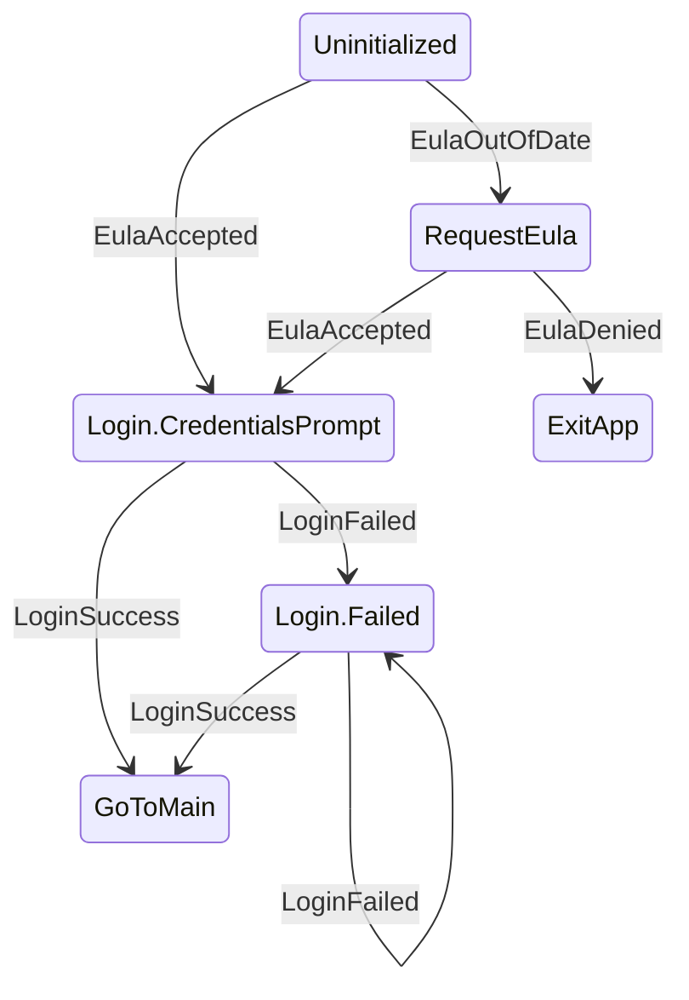

# KSM

A finite state machine for Kotlin Multiplatform

[](https://github.com/AdamWardVGP/KSM/releases)
[](https://github.com/AdamWardVGP/ksm/actions/workflows/ci.yml)
[](https://www.mozilla.org/en-US/MPL/2.0/)

---

# What is KSM

KSM is a deterministic, reflection-free finite state machine for defining explicit state graphs.
It is designed for application flows where correctness, predictability, and observability matter
more than convenience abstractions.

This library comes from a repeated pattern: onboarding flows, permission gates, startup logic,
and other “flowchart-shaped” problems that don’t map cleanly to MVVM, reducers, or a growing ad-hoc list of booleans.
KSM treats these problems as what they are — state graphs — and makes them executable.

In particular this state machine offers a few nice features:
- 🏗️ Easy graph creation via DSL
- 💽 Supports data classes as States, with Events that can carry payloads used to construct them
- 🌊 States are observable via Flow
- 🧜‍♀️ Exportable directly to Mermaid diagrams

The state machine itself is:
- 🪞 Reflection free
- ➡️ Deterministic: In a given state one event → one transition 
- ⛔ Non-reentrant: events are processed serially 
- 👻 Side effects are explicitly outside the FSM


## How do I use it

## 1. Add the gradle dependency
```kotlin
    implementation("dev.adamwardvgp.ksm:ksm:<version>")
```

## 2. Defines a state graphs with a DSL builder.

```kotlin

val appLaunchStateMachine = stateMachine<AppStates, AppEvents> {
    initialState = AppStates.Uninitialized
    
    //define the "fromState"
    state<AppStates.Uninitialized> {
        //"on" specifies what event transitions to a new state
        on<AppEvents.EulaOutOfDate>() transitionTo AppStates.RequestEula
        //States can be nested sealed classes
        on<AppEvents.EulaAccepted>() transitionTo AppStates.Login.CredentialsPrompt
    }
    
    state<AppStates.Login> {
        on<AppEvents.LoginSuccess>() transitionTo AppStates.GoToMain
        //Events can carry payloads and pass them into states themselves
        on<AppEvents.LoginFailed>() transitionWith { _, event -> AppStates.Login.Failed(event.reason) }
    }
}
```

Your current state will transition into the next state based on received Events. The state machine itself should not be performing other work internally and functions purely as a mapper `(CurrentState, Event) -> ResultState`. 

> ⚠️ I/O, network calls, persistence should be triggered in response to a state transition, and not inside the state machine itself.

To monitor the state simply use flow collection. To send events into the machine just make calls to `dispatchEvent(...)`

```kotlin
appLaunchStateMachine.currentState.collect { newState-> ... }

appLaunchStateMachine.dispatchEvent(EulaOutOfDate)
```

# What do you use it for?

My specific use case at the moment - exposing a StateFlow from a ViewModel to composables. Since states are data classes we can also mark them as `@Serializable` and throw them into Android's `savedStateHandle` to get back to where we were.

check out `/samples/KmpApp` for more detailed source

# You said free graphs?

Yes I did. You can run a gradle task `./gradlew graphKSM` to pull render out all the state machines in your project into Mermaid diagrams.



The diagrams are generated directly from the compiled state graph, and written to `build/ksm/ as `.mmd` files. 

While you should still test write tests for your state machine this gives a good way to sanity check.

If the diagram is wrong → the code is wrong.

## What KSM is not

- Not Redux / MVI
- Not a workflow engine
- Not a side-effect runner
- Not a persistence layer
- Not a UI state container

KSM is a state graph.  
It describes *what state follows what*, nothing more.

# FAQ

## Why not sealed classes and `when`?

You can model state transitions with sealed classes and `when` statements.
Most teams do — until the logic spreads across multiple files and loses its shape.

Typical problems with `when`-based transitions:
- Transitions are implicit and scattered
- There is no single source of truth for the graph
- It is easy to add a new state without updating all transitions
- Any state can go to any other state, leading to consistency issues
- You cannot export or visualize the flow
- Once 5 states interconnect you create a pentagram and accidentally summon demons into your codebase 😈

KSM solves this by:
- Defining the entire state graph in one place
- Making transitions restrict which states link to other states
- Enforcing one transition per `(State, Event)`
- Treating the graph itself as a first-class artifact

If your logic can be described as a flowchart, KSM keeps it a flowchart.
