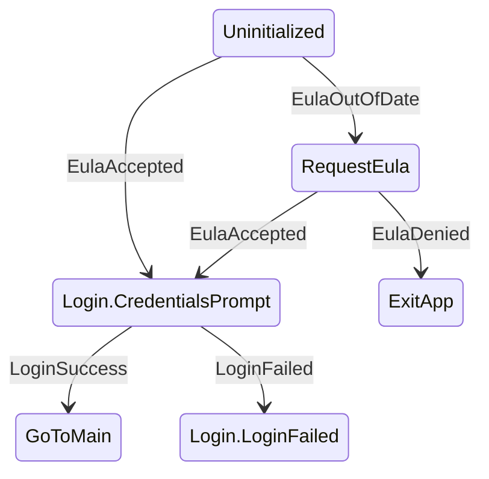

# 🔁 KSM

A finite state machine for Kotlin Multiplatform

[](https://central.sonatype.com/artifact/coffee.adammakes.ksm/ksm)
[](https://github.com/AdamWardVGP/KSM/actions/workflows/ci.yml)
[](https://www.mozilla.org/en-US/MPL/2.0/)

---

# 🔎 What is KSM

KSM is a finite state machine for defining explicit state graphs.

In particular this state machine offers a few nice features:
- 🏗️ Easy graph creation via DSL
- 💽 Sealed classes as States, with Events that can carry payloads used to construct them
- 🌊 Transitions observable via Flow
- 🧜‍♀️ Exportable directly to Mermaid diagrams


The state machine itself is:
- 🪶 Lightweight: dispatch uses `KClass` references, no annotation processing or code generation required
- ➡️ Deterministic: In a given state one event → one transition
- ⛔ Non-reentrant: events are processed serially
- 🔒 Pure: transition reducers `(State, Event) -> State`
- 👻 Optional side effect layer with per-state lifecycle management

---

# 🚀 How do I use it

## 1. Add the gradle dependency
```kotlin
implementation("coffee.adammakes.ksm:ksm:<version>")
```

## 2. Define a state graph with a DSL builder.

```kotlin
val appLaunchStateMachine = stateMachine<AppStates, AppEvents> {

    initialState = AppStates.Uninitialized //Tell the machine what state to start in
    dispatchedOn = coroutineScope //Give it a context to dispatch events and run them

    //Then create your graph:
    //define a "fromState"
    state<AppStates.Uninitialized> {
        //"on" specifies what event triggers a transition
        // and "transitionTo" says what state to go to.
        on<AppEvents.EulaOutOfDate>() transitionTo AppStates.RequestEula

        //States can be nested sealed classes
        on<AppEvents.EulaAccepted>() transitionTo AppStates.Login.CredentialsPrompt
    }

    state<AppStates.Login> {
        on<AppEvents.LoginSuccess>() transitionTo AppStates.GoToMain

        state<AppStates.Login.CredentialsPrompt> {
            //Events can carry payloads and pass them into new states via transitionWith
            on<AppEvents.LoginFailed>() transitionWith { _, event ->
                AppStates.Login.Failed(event.reason)
            }
        }

        state<AppStates.Login.Failed> {}
    }
}
```

### Hierarchical states

Nest `state` declarations when related states share behavior:

```kotlin
state<AdventureState.Finished> {
    on<AdventureEvent.Restart>() transitionTo AdventureState.Start

    state<AdventureState.GameOver> {}
    state<AdventureState.Treasure> {}
}
```

The machine still contains one concrete state such as `GameOver` or `Treasure`. If that leaf does
not handle `Restart`, KSM walks outward to `Finished`. A child handler for the same event would take
precedence over its parent.

Hierarchy is declared by the DSL rather than inferred from every Kotlin interface a state
implements. A child therefore needs to appear inside its parent's builder, including terminal
children whose builders are empty.

If upgrading code that previously relied on implicit supertype matching, move the concrete state
declarations into the parent:

```kotlin
// Before: CredentialsPrompt matched Login only through Kotlin runtime type checks.
state<AppStates.Login> { on<LoginSuccess>() transitionTo GoToMain }

// After: the relationship is explicit and appears in generated diagrams.
state<AppStates.Login> {
    on<LoginSuccess>() transitionTo GoToMain
    state<AppStates.Login.CredentialsPrompt> {}
}
```

KSM hierarchy is single-region: there is always one active concrete leaf. It intentionally does
not provide parallel/orthogonal regions or history pseudostates.

## 3. Monitor the FSM and dispatch events

```kotlin
//Just collect the flow
appLaunchStateMachine.currentState.collect { newState -> ... }

//Dispatch events to trigger transitions
appLaunchStateMachine.dispatchEvent(EulaOutOfDate)
```

## 4. Add side effects (optional)

Side effects are async work triggered upon state entry: network calls, timers, analytics, db writes - things that affect the outside world. However their result feeds back as an event. To do so I include an effects module:

```kotlin
implementation("coffee.adammakes.ksm:ksm-effects:<version>")
```

Wrap your state machine with `withEffects` and register per-state work using the `onEnter` DSL:

```kotlin
val effectedMachine = appLaunchStateMachine.withEffects(coroutineScope) {
    onEnter<AppStates.Login.CredentialsPrompt>() effect ::attemptAutoLogin
    onEnter<AppStates.GoToMain>() effect ::loadUserProfile
}
```

Each effect is a `suspend (State) -> Event`. Only one effect can be registered per state —
registering a second one for the same state throws. When the machine leaves a state, an in-flight
effect for that state is cancelled automatically. When an effect completes, the returned event is
dispatched back into the machine.

Hierarchical parents and children may each register one effect. Entering a child starts its
registered parent and child effects. Moving between siblings preserves the parent effect while
cancelling the exited child's effect; leaving the parent subtree cancels both. A transition to a
new value of the same concrete state restarts the leaf effect without restarting its parents.

Effects registered via `withEffects` also appear as notes in generated Mermaid diagrams.

## Guidelines

Transition reducers should stay pure and are intended to function as a mapper
`(CurrentState, Event) -> ResultState`.

---

# 🧠 Sharpen your wits

Check out the detailed sample KMP app in the `/sample/` directory.

This demonstrates exposing a `StateFlow` from a `ViewModel` to `@Composable` UI. Since states are data classes, they can also be marked `@Serializable` and stored in Android's `SavedStateHandle`—so the UI can pick up right where you left off.

KSM does not keep hidden history or persistence data for a hierarchy. Additional workflow data and
database snapshots belong in the application's concrete state, which can be supplied again as
`initialState`.

Launch the app to jump into a choose your own adventure style dialog flow. Can you defeat the monsters 🧌 and claim the treasure 👑? or will fate have a different plan for you 💀?

---

# 📊 Generate State Machine Diagrams

All KSM state machines in your project can be exported as Mermaid diagrams at compile time via a Kotlin IR compiler plugin.

## Setup

Apply the plugin in your `build.gradle.kts`:

```kotlin
plugins {
    id("coffee.adammakes.ksm.ir") version "<version>"
}

//optionally set an output directory
ksm { outputDir = layout.projectDirectory.dir("ksmGraphs") }
```

That's it. Every `compileKotlin` task will automatically write `.mmd` files to `build/ksmGraphs/` — one per state machine found in your source.



💡 Tip: If the diagram looks wrong, your code might be wrong. These diagrams are a sanity check and a great way to review state transitions visually.

Hierarchical declarations are emitted as nested Mermaid compound states, including transitions
and effect notes declared on parent states.

---

# 🙋🏽‍♂️ FAQ

## Why not sealed classes and `when`?

You can model state transitions with sealed classes and `when` statements.
Most teams do and it works fine till your codebase begins to grow. You can [read my blog](http://adammakes.coffee/software/65271_ways_to_be_wrong) for more details about why it's a bad idea. But the short and sweet version is this.

Typical problems with `when`-based transitions:
- There is no enforcement in which state can go to any other state, and oftentimes
bugs come from these unexpected transitions.
- If ordering of transitions does matter, there's no documentation of it, and is often lost in
institutional knowledge.

KSM solves this by:
- Defining the entire state graph in one place
- Making transitions restrict which states link to other states
- Enforcing one transition per `(State, Event)`
- Treating the graph itself as a first-class artifact

If your logic can be described as a flowchart, KSM keeps it a flowchart.

---

Mozilla Public License Version 2.0
==================================

Copyright (C) 2025 Adam Ward

This Source Code Form is subject to the terms of the Mozilla Public
License, v. 2.0. If a copy of the MPL was not distributed with this
file, You can obtain one at https://mozilla.org/MPL/2.0
