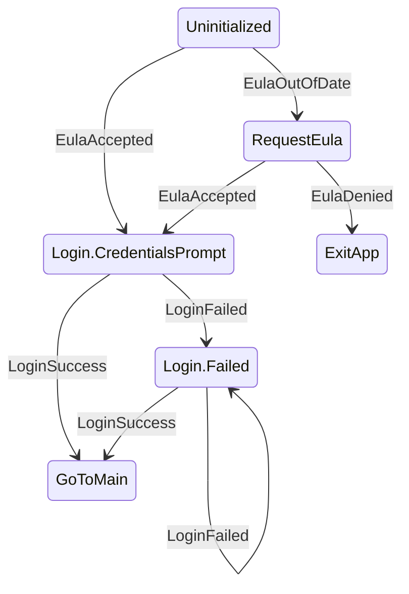

# 🔁 KSM

A finite state machine for Kotlin Multiplatform

[](https://github.com/AdamWardVGP/KSM/releases)
[](https://github.com/AdamWardVGP/ksm/actions/workflows/ci.yml)
[](https://www.mozilla.org/en-US/MPL/2.0/)

---

# 🔎 What is KSM

KSM is a finite state machine for defining explicit state graphs.
It is designed for application flows where correctness, predictability, and observability matter
more than convenient abstractions.

In particular this state machine offers a few nice features:
- 🏗️ Easy graph creation via DSL
- 💽 Supports data classes as States, with Events that can carry payloads used to construct them
- 🌊 States are observable via Flow
- 🧜‍♀️ Exportable directly to Mermaid diagrams

The state machine itself is:
- 🪞 Reflection free
- ➡️ Deterministic: In a given state one event → one transition 
- ⛔ Non-reentrant: events are processed serially 
- 👻 Side effects are explicitly outside the FSM

---

# 🚀 How do I use it

## 1. Add the gradle dependency
```kotlin
implementation("dev.adamwardvgp.ksm:ksm:<version>")
```

## 2. Defines a state graphs with a DSL builder.

```kotlin

val appLaunchStateMachine = stateMachine<AppStates, AppEvents> {
    
    initialState = AppStates.Uninitialized //Tell the machine what state to start in
    dispatchedOn = coroutineScope //Give it a context to collect events and run them
    
    //define the "fromState"
    state<AppStates.Uninitialized> {
        //"on" specifies what event transitions to a new state
        on<AppEvents.EulaOutOfDate>() transitionTo AppStates.RequestEula
        //States can be nested sealed classes
        on<AppEvents.EulaAccepted>() transitionTo AppStates.Login.CredentialsPrompt
    }
    
    state<AppStates.Login> {
        on<AppEvents.LoginSuccess>() transitionTo AppStates.GoToMain
        //Events can carry payloads and pass them into states themselves
        on<AppEvents.LoginFailed>() transitionWith { _, event -> AppStates.Login.Failed(event.reason) }
    }
}
```

## 3. Monitor the FSM, and listen to events

```kotlin
//Just collect the flow
appLaunchStateMachine.currentState.collect { newState -> ... }

//And then dispatch events to the machine to trigger transitions to new states
appLaunchStateMachine.dispatchEvent(EulaOutOfDate)
```

## Outcomes and Guidelines

Your current state will transition into the next state based on received Events. 

The state machine itself should not be performing other work internally and function purely as a mapper `(CurrentState, Event) -> ResultState`.

> ⚠️ I/O, network calls, persistence should be triggered in response to a state transition, and not inside the state machine itself.

---

# 🧠 Sharpen your wits 

Check out the detailed sample KMP app in the `/sample/` directory.

This demonstrates exposing a `StateFlow` from a `ViewModel` to `@Composable` UI. Since states are data classes, they can also be marked `@Serializable` and stored in Android’s `SavedStateHandle`—so the UI can pick up right where you left off.

Launch the app to jump into a choose your own adventure style dialog flow. Can you defeat the monsters 🧌 and claim the treasure 👑? or will fate have a different plan for you 💀?

---

# 📊 Generate State Machine Diagrams

All KSM state machines in your project can be exported as Mermaid diagrams for free!

You can run a gradle task `./gradlew graphKSM` to pull render out all the state machines in your project into Mermaid diagrams.



The diagrams are generated directly from the compiled state graph, and written to `build/ksm/ as `.mmd` files. 

💡 Tip: If the diagram looks wrong, your code might be wrong. These diagrams are a sanity check and a great way to review state transitions visually.

---

# 🙋🏽‍♂️ FAQ

## Why not sealed classes and `when`?

You can model state transitions with sealed classes and `when` statements.
Most teams do — until the logic spreads across multiple files and loses its shape.

Typical problems with `when`-based transitions:
- Transitions are implicit and scattered
- There is no single source of truth for the graph
- It is easy to add a new state without updating all transitions
- Any state can go to any other state, leading to consistency issues
- You cannot export or visualize the flow
- Some poor teammate comes in years later and takes a week to draw his own diagram to debug whats going on.
- Once 5 states interconnect you create a pentagram which results in summoning demons into your codebase 😈

KSM solves this by:
- Defining the entire state graph in one place
- Making transitions restrict which states link to other states
- Enforcing one transition per `(State, Event)`
- Treating the graph itself as a first-class artifact

If your logic can be described as a flowchart, KSM keeps it a flowchart.

---

Mozilla Public License Version 2.0
==================================

Copyright (C) 2025 Adam Ward

This Source Code Form is subject to the terms of the Mozilla Public
License, v. 2.0. If a copy of the MPL was not distributed with this
file, You can obtain one at https://mozilla.org/MPL/2.0nah
