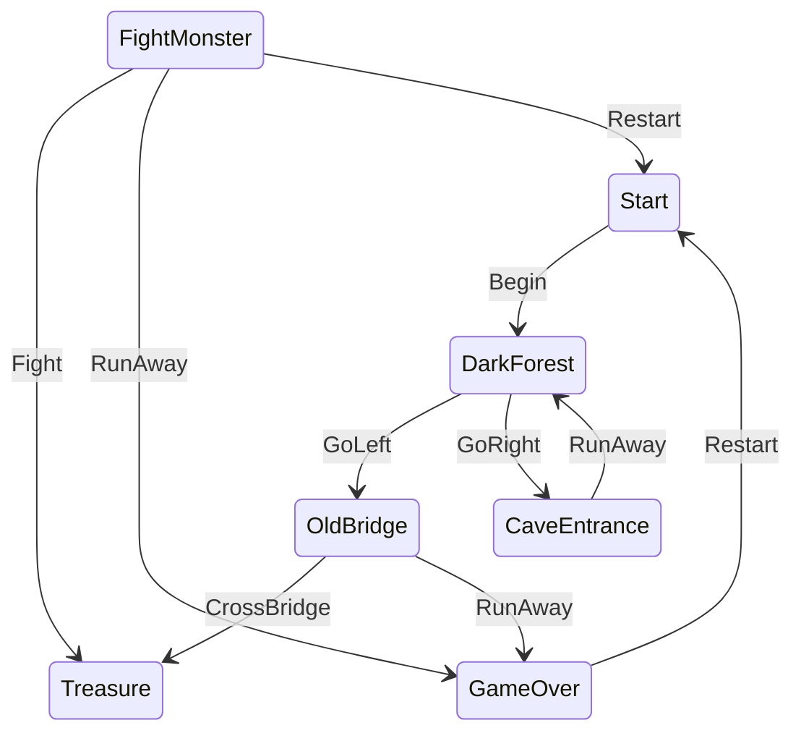

# Adventure Sample

A choose-your-own-adventure app demonstrating KSM in a Compose Multiplatform ViewModel.



---

# Guide: Modeling with State Machines

If you're new to state machines - welcome! They're a powerful tool but knowing how to use them and 
and when to use them is a key skill. This is a practical guide to help bridge how to think in 
events, states, and effects along with best practice tips and some things to watch out for.

---

## The mental model

A state machine has three moving parts:

- **States** — These represent a *named situations* your system can be in (`Idle`, `Loading`, `Loaded`, `Failed`).
- **Events** — *facts about things that happened* (`RetryClicked`, `RequestSucceeded`, `RequestFailed`).
- **Effects** — *work that needs to happen* as a result of being in a state (fire an API call, start a timer).

The machine's job: *given where I am and what just happened, where do I go next?* Simply this is a pipeline. An Event comes from the outside world, the state machine decides what to do next, and finally an effect is triggered.


---

## Why bother? The scattered-flags problem

Most stateful bugs come from state being *scattered*. A few booleans — `isLoading`, `hasError`, `dataReady` — each seem reasonable alone. But four booleans actually describe sixteen combinations, and most are nonsense: `isLoading = true` AND `hasError = true` AND `dataReady = true` — what does that even mean? You end up writing defensive checks against situations that should never exist.

A state machine flips this. Instead of tracking flags and hoping they stay consistent, you enumerate the handful of situations that are *actually legal* and the transitions between them. Illegal combinations can't be represented. Bugs stop being "how did we get into this impossible state?" — a much harder question — and become "this transition shouldn't exist," which you can often spot just by looking at the diagram.

---

## What is a State?

A state is a **distinct situation** the system can be in. The machine is always in exactly one.

A useful question: *can these two things be true at the same time?*

- "User is on the form" and "login request is in-flight" → No. Two states.
- "User is logged in" and "there's an error message" → No. Two states.
- "The request failed" and "the username is pre-filled" → Yes — one state: `Failed(username, reason)`.

### States carry their own data

A state isn't just a label — it carries the data that only exists *in that situation*.

A `Submitting` state should carry the credentials being submitted. A `Failed` state should carry the error reason and maybe the username so you can pre-fill the form. A `LoggedIn` state should carry the user's identity.

```kotlin
// Don't: states as bare labels, data floating outside
sealed interface LoginState
data object Idle : LoginState
data object Loading : LoginState
data object Success : LoginState
data object Failure : LoginState

var username = ""
var errorMessage: String? = null   // only non-null in Failure — but nothing enforces that
var userId: String? = null         // only non-null in Success — but nothing enforces that

// Do: data lives on the state that needs it
sealed interface LoginState
data object EnteringCredentials : LoginState
data class Submitting(val username: String, val password: String) : LoginState
data class Failed(val username: String, val reason: String) : LoginState
data class LoggedIn(val userId: String) : LoginState
```

In `Submitting`, credentials are always present, and the type guarantees it. In `Failed`, the username is right there for pre-filling. `LoggedIn` can never coexist with an error message. If data can be `null` depending on the current state, that's a signal it belongs *inside* the state, not alongside the machine.

### States vs. changing values

Add a new state only when *what the machine is allowed to do changes*. Don't add one just because a value changed.

A retry counter going `2 → 3` is data — it rides along inside `Loading(attempt = 3)`. It is *not* `LoadingFirstTry`, `LoadingSecondTry`, `LoadingThirdTry`.

> Quick test: *"Does this change what events are valid, or how the machine responds?"* Yes → new state. No → it's data on the current state.

---

## What is an Event?

An event is **something that happened** — an input that drives a transition. Name events for what occurred, not for what should happen next.

```kotlin
// Do: facts about the world
data class LoginSucceeded(val userId: String) : Event
data class LoginFailed(val reason: String) : Event
data object RetryClicked : Event

// Don't: commands about what to do
data object GoToSuccessScreen : Event   // this is a decision — it belongs in the machine
data object TriggerRetry : Event        // command, not a fact
```

If your event already says what to do next, then whoever sent it made the decision — and your logic has leaked back out of the machine. Keep events describing what happened and let the machine decide the consequence.

---

## What is an Effect?

An effect is anything that reaches out to the world: network calls, timers, analytics, hardware. They are **work triggered by entering a state**

The key rule: **effects never write state directly**. The outcome always comes back into the machine as a new event. That keeps the machine the single source of truth.

```kotlin
// Don't: effect reaches around and mutates state behind the machine's back
scope.launch {
    val result = api.fetchUser()
    userId = result.id    // the machine doesn't know this happened
    isLoading = false
}

// Do: effect reports its outcome back as an event
scope.launch {
    try {
        val result = api.fetchUser()
        machine.dispatch(Event.FetchSucceeded(result.id))
    } catch (e: Exception) {
        machine.dispatch(Event.FetchFailed(e.message))
    }
}
```

---

## Worked example: from mess to machine

The same feature built three ways. Feature: a form takes a name, checks a local directory, falls back to an API if unknown, shows a greeting. The API can fail, so the user needs retry.

```kotlin
// Shared backend
val localDirectory = mapOf("ada" to "id-0001", "grace" to "id-0002")

suspend fun fetchId(name: String): String {
    delay(500)
    if (name.isBlank()) throw IllegalArgumentException("name was empty")
    return "id-" + name.lowercase().hashCode().toUInt().toString(16).take(4)
}
```

### Stage 1 — Scattered fields

```kotlin
class GreeterImperative(private val scope: CoroutineScope) {
    var name: String = ""
    var greeting: String? = null
    var isLoading: Boolean = false
    var errorMessage: String? = null

    fun onSubmit() {
        errorMessage = null
        val local = localDirectory[name.lowercase()]
        if (local != null) {
            greeting = "Hello world, $name! ($local)"
            return
        }
        isLoading = true
        scope.launch {
            try {
                val fetched = fetchId(name)
                greeting = "Hello world, $name! ($fetched)"
            } catch (e: Exception) {
                errorMessage = e.message
            } finally {
                isLoading = false
            }
        }
    }
}
```

Four fields means sixteen combinations, most nonsense. Submit twice quickly and two coroutines race to write `greeting`. The UI has to reconstruct "where are we?" from several flags at once. Nothing stops a double-submit.

### Stage 2 — The enum trap (most common mistake)

```kotlin
enum class Status { IDLE, LOADING, DONE, ERROR }

class GreeterHalfMachine(private val scope: CoroutineScope) {
    var status: Status = Status.IDLE   // looks like a state machine…

    // …but the real data still lives outside
    var name: String = ""
    var greeting: String? = null
    var errorMessage: String? = null

    fun onSubmit() {
        val local = localDirectory[name.lowercase()]
        if (local != null) {
            greeting = "Hello world, $name! ($local)"
            status = Status.DONE
            return
        }
        status = Status.LOADING
        scope.launch {
            try {
                val fetched = fetchId(name)
                greeting = "Hello world, $name! ($fetched)"   // writes state directly
                status = Status.DONE
            } catch (e: Exception) {
                errorMessage = e.message
                status = Status.ERROR
            }
        }
    }
}
```

This is the trap most people fall into right after learning the term "state machine." The enum is just a label — the actual data (`greeting`, `errorMessage`, `name`) still lives in mutable fields outside. That means:

- `status = DONE` doesn't guarantee `greeting != null`. A crash waiting to happen.
- You can be `status = DONE` with a leftover `errorMessage` from a previous failure.
- The coroutine reaches in and writes `greeting` directly instead of reporting a result — the machine doesn't know it happened.

You did the work of adding a machine and got almost none of the benefit.

### Stage 3 — The real thing

```kotlin
// Each situation carries exactly the data it needs — nothing it doesn't
sealed interface State {
    data object Idle : State
    data class Loading(val name: String) : State
    data class Greeted(val name: String, val id: String) : State
    data class Failed(val name: String, val message: String) : State
}

// Events are facts about what happened
sealed interface Event {
    data class Submitted(val name: String) : Event
    data class IdFetched(val id: String) : Event
    data class FetchFailed(val message: String) : Event
    data object RetryClicked : Event
}
```

The transition logic — given current state + event, return next state. No network calls, no timers, no side effects of any kind. Just decisions.

```kotlin
fun transition(state: State, event: Event): Pair<State, String?> = when (state) {
    is State.Idle, is State.Greeted -> when (event) {
        is Event.Submitted -> {
            val local = localDirectory[event.name.lowercase()]
            if (local != null) State.Greeted(event.name, local) to null
            else State.Loading(event.name) to event.name   // signal: fetch this name
        }
        else -> state to null
    }
    is State.Loading -> when (event) {
        is Event.IdFetched   -> State.Greeted(state.name, event.id) to null
        is Event.FetchFailed -> State.Failed(state.name, event.message) to null
        else -> state to null   // second submit while loading is ignored — for free
    }
    is State.Failed -> when (event) {
        is Event.RetryClicked -> State.Loading(state.name) to state.name
        is Event.Submitted    -> transition(State.Idle, event)
        else -> state to null
    }
}
```

The greeting text is derived from the state rather than stored separately — so it can never be stale:

```kotlin
fun render(state: State): String = when (state) {
    State.Idle        -> "Enter a name."
    is State.Loading  -> "Looking up ${state.name}…"
    is State.Greeted  -> "Hello world, ${state.name}! (${state.id})"
    is State.Failed   -> "Couldn't greet ${state.name}: ${state.message}"
}
```

The runner — the only part that touches the real world:

```kotlin
class GreeterMachine(private val scope: CoroutineScope) {
    var state: State = State.Idle
        private set

    fun dispatch(event: Event) {
        val (next, nameToFetch) = transition(state, event)
        state = next
        if (nameToFetch != null) {
            scope.launch {
                try {
                    dispatch(Event.IdFetched(fetchId(nameToFetch)))
                } catch (e: Exception) {
                    dispatch(Event.FetchFailed(e.message ?: "unknown error"))
                }
            }
        }
    }
}
```

Why this one works:

- Every value lives on a state — `name`, `id`, `message`. Nothing floating outside.
- `Loading` carries an `attempt` field if you need retry counting — not a new state per attempt.
- Events are facts: `IdFetched`, `FetchFailed`, `Submitted`.
- The transition function only *decides* — it never performs the fetch.
- The coroutine runs at the boundary and reports back as an event. No side-door writes.
- `isLoading = true` AND `greeting != null` is now *impossible to represent*.

KSM provides a DSL that wraps this pattern — but the shape you're declaring is exactly this.

---

## Modeling the adventure

This sample applies these ideas to a simple game:

```kotlin
sealed interface AdventureState {
    data object Start : AdventureState
    data object DarkForest : AdventureState
    data object OldBridge : AdventureState
    data object CaveEntrance : AdventureState
    data class FightMonster(val monster: String) : AdventureState  // name lives here
    data object Treasure : AdventureState
    data class GameOver(val reason: String) : AdventureState       // reason lives here
}
```

`FightMonster` carries the monster name because that data only exists *while fighting*. `GameOver` carries the reason because it only exists *at game over*. Neither needs external storage.

Effects trigger emoji rain on state entry:

```kotlin
machine.withEffects(viewModelScope) {
    onEnter<AdventureState.Treasure>() effect ::rainCoins   // 🪙 on treasure
    onEnter<AdventureState.GameOver>() effect ::rainSkulls  // 💀 on death
}
```

These reach out to the world — emitting into a `SharedFlow` the UI collects. The state machine stays focused on decisions; the effects layer handles the doing.

---

## Quick reference

**Do**
- Put each state's data *on* that state — the compiler stops you from touching data that doesn't exist in the current situation.
- Name states as situations (nouns); name events as past-tense facts.
- Handle every `(state, event)` pair deliberately — even if the answer is "ignore."
- Keep transition logic focused on decisions only — no network calls, no timers.
- Feed effect results back into the machine as events.

**Don't**
- Don't keep state outside the machine (no shadow flags, no side caches).
- Don't add a new state just because a value changed — that's data on the current state.
- Don't bake "what to do next" into the event name.
- Don't let an effect write state directly — send a result event instead.
- Don't reach for a boolean when you need two independent dimensions of state. That's a signal to compose or nest machines, not to bolt on a flag.
