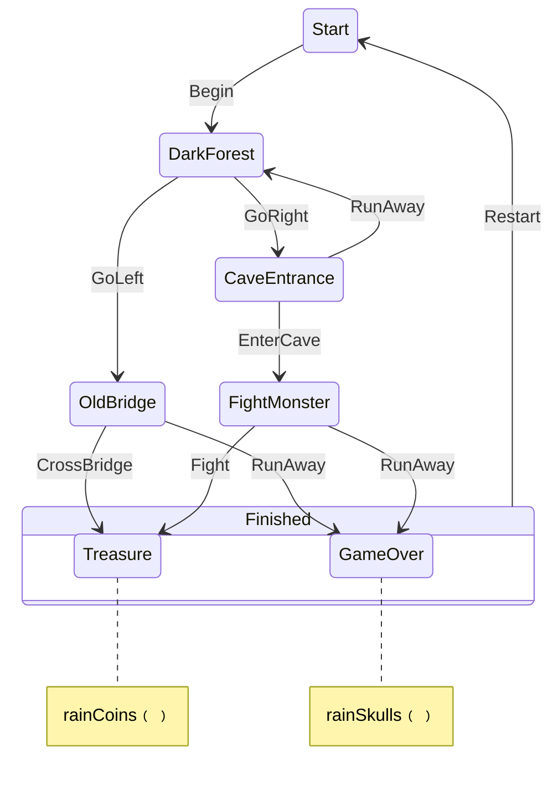

# Adventure Sample

A choose-your-own-adventure app demonstrating KSM in a Compose Multiplatform ViewModel.

## Run on iOS

The Xcode project is generated from `iosApp/project.yml` and is intentionally not versioned.

```shell
cd sample/iosApp
xcodegen generate
open KsmSample.xcodeproj
```

Select an iOS simulator and run the `KsmSample` scheme. The Xcode build invokes Gradle to build and
embed the shared Kotlin framework.



Before we get into the example though let's start with the basics.

---

# Guide: Modeling with State Machines

If you're new to state machines - welcome! They're a powerful tool but knowing how to use them and 
 when to use them is a key skill. This is a practical guide to help bridge how to think in 
events, states, and effects along with best practice tips and some things to watch out for.

---

## The mental model

A state machine has three moving parts:

- **States** — These represent a *named situation* your system can be in (`Idle`, `Loading`, `Loaded`, `Failed`).
- **Events** — *facts about things that happened* (`RetryClicked`, `RequestSucceeded`, `RequestFailed`).
- **Effects** — *work that needs to happen* as a result of being in a state (fire an API call, start a timer).

The machine's job is pure decision making: *given where I am and what just happened, where do I go next?* You can think of it as a pipeline: an Event comes from the outside world, the state machine decides what to do next, and finally an effect is triggered.

---

## Why bother? The scattered-flags problem

Most stateful bugs come from state being *scattered*. A few booleans representing `isLoading`, `hasError`, `dataReady` each seem reasonable alone. But four booleans actually describe sixteen combinations, and most are nonsense: `isLoading = true` AND `hasError = true` AND `dataReady = true` what does that even mean? You end up writing defensive checks against situations that should never exist.

A state machine flips this. Instead of tracking flags and hoping they stay consistent, you enumerate the handful of situations that are *actually legal* and how you move between them. Illegal combinations can't be represented. Bugs stop being "how did we get into this impossible state?" (a much harder question that usually requires much time debugging) and instead become answering "this transition shouldn't exist," which you can often spot just by looking at the diagram.

---

## What is a State?

A state is a **distinct situation** the system can be in. The machine is always in exactly one.

A useful question: *can these two things be true at the same time?*

- "User is able to input on a login form" and "login request is in-flight" → No. Two states.
- "User is logged in" and "there was an error authenticating" → No. Two states.
- "The request failed" and "the user has already input their name" → Yes — one state: `Failed(username, reason)`.

### States carry their own data

In that last example we saw how A state isn't just a label: its a carrier for data that only exists *in that situation*.

A `Submitting` state should hold the credentials being submitted. A `Failed` state should hold the error reason and maybe the username so you can re-fill an input form. A `LoggedIn` state should carry the user's identity.

Lets look at an example

```kotlin
// Here's an example of what not to do. States can be bare labels, but when data floats outside
// we lost identity on when that data is relevant.
sealed interface LoginState
data object Idle : LoginState
data object Loading : LoginState
data object Success : LoginState
data object Failure : LoginState

var username = ""
var errorMessage: String? = null   // only non-null in Failure — but nothing enforces that
var userId: String? = null         // only non-null in Success — but nothing enforces that

// Do: put data in your states. Here we can see EXACTLY when we have non-null values
// because we only hold onto them in the state where they are relevant.
sealed interface LoginState
data object EnteringCredentials : LoginState
data class Submitting(val username: String, val password: String) : LoginState
data class Failed(val username: String, val reason: String) : LoginState
data class LoggedIn(val userId: String) : LoginState
```

In `Submitting`, credentials are always present, and the type guarantees it. In `Failed`, the username is there to rejoin the input on the UI. And here `LoggedIn` can never coexist with an error message. 

A simple rule: If data can be `null` depending on the current state, that's a signal it belongs *inside* the state, not alongside the machine.

### States vs. changing values

Add a new state only when *what the machine is allowed to do changes*. Don't add one just because a value changed.

A retry counter going `2 to 3` is data. It should live inside `Loading(attempt = 3)`. It is *not* `LoadingFirstTry`, `LoadingSecondTry`, `LoadingThirdTry`.

---

## What is an Event?

An event is **something that happened** — an input that drives a transition. Name events for what occurred, not for what should happen next.

```kotlin
// Do: facts about the world
data class LoginSucceeded(val userId: String) : Event
data class LoginFailed(val reason: String) : Event
data object RetryClicked : Event

// Don't: commands about what to do
data object GoToSuccessScreen : Event   // this is a decision. A state that should be in the machine, triggered by some event.
data object TriggerRetry : Event        // command, not a fact
```

If your event already says what to do next, then the FSM is no longer the decision making authority and your logic has leaked out of the machine. Keep events describing what happened and let the machine decide the consequence.

---

## What is an Effect?

An effect is anything that reaches out to the world: network calls, timers, analytics, hardware. They are **work triggered by entering a state**

The key rule: **effects never write state directly**. The outcome always comes back into the machine as a new event. That keeps the machine the single source of truth.

```kotlin
// Don't: effect stores data outside the FSM
scope.launch {
    val result = api.fetchUser()
    userId = result.id    // the machine doesn't know this happened
    isLoading = false
}

// Do: effect reports its outcome back as an event
scope.launch {
    try {
        val result = api.fetchUser()
        machine.dispatch(Event.FetchSucceeded(result.id))
    } catch (e: Exception) {
        machine.dispatch(Event.FetchFailed(e.message))
    }
}
```

In doing this we go from pipeline, to mutually recursive loop. Events drive state changes, drive
effects, and then drive events again. We have a loop where the system feeds into itself, which 
helps ensure the machine is always in a consistent state and that it remains the single source of
truth for decision making authority.

---

## Worked example: from mess to machine

I want to show the same feature built three ways. Here we have a form that takes a name, checks a 
local directory, falls back to an API if unknown, then shows a greeting. The API can fail, so the 
user needs the ability to retry.

```kotlin
// Shared backend
val localDirectory = mapOf("ada" to "id-0001", "grace" to "id-0002")

suspend fun fetchId(name: String): String {
    if (name.isBlank()) throw IllegalArgumentException("name was empty")
    return "id-" + name.lowercase().hashCode().toString(16).take(4)
}
```

### Stage 1: Scattered fields

```kotlin
class GreeterImperative(private val scope: CoroutineScope) {
    var name: String = ""
    var greeting: String? = null
    var isLoading: Boolean = false
    var errorMessage: String? = null

    fun onSubmit() {
        errorMessage = null
        val local = localDirectory[name.lowercase()]
        if (local != null) {
            greeting = "Hello world, $name! ($local)"
            return
        }
        isLoading = true
        scope.launch {
            try {
                val fetched = fetchId(name)
                greeting = "Hello world, $name! ($fetched)"
            } catch (e: Exception) {
                errorMessage = e.message
            } finally {
                isLoading = false
            }
        }
    }
}
```

Four fields means sixteen combinations,and most of those combinations are not actually possible. 
Even worse if you submit twice quickly and two coroutines race to write `greeting` (and `error`!). 
The UI has to reconstruct "where are we?" from several flags at once. Nothing stops a double-submit.

### Stage 2: The enum

Enums and sealed classes are a good incremental improvement. They solve the problem that really
you can only be in one of these states at a time. However we still have the scattered-flags problem,
and the `onSubmit()` race issue.

```kotlin
enum class Status { IDLE, LOADING, DONE, ERROR }

class GreeterHalfMachine(private val scope: CoroutineScope) {
    var status: Status = Status.IDLE   // looks like a state machine…

    // …but the real data still lives outside
    var name: String = ""
    var greeting: String? = null
    var errorMessage: String? = null

    fun onSubmit() {
        val local = localDirectory[name.lowercase()]
        if (local != null) {
            greeting = "Hello world, $name! ($local)"
            status = Status.DONE
            return
        }
        status = Status.LOADING
        scope.launch {
            try {
                val fetched = fetchId(name)
                greeting = "Hello world, $name! ($fetched)"   // writes state directly
                status = Status.DONE
            } catch (e: Exception) {
                errorMessage = e.message
                status = Status.ERROR
            }
        }
    }
}
```

This is the trap most people fall into right after learning the term "state machine." The enum is 
just a label.  The actual data (`greeting`, `errorMessage`, `name`) still lives in mutable fields 
outside. That means:

- `status = DONE` doesn't guarantee `greeting != null`. A crash waiting to happen.
- You can be `status = DONE` with a leftover `errorMessage` from a previous failure.
- The coroutine reaches in and writes `greeting` directly instead of reporting a result — the machine doesn't know it happened.

You did the work of tracking state and got almost none of the benefit.

### Stage 3: The real thing

```kotlin
// Each situation carries exactly the data it needs — nothing it doesn't
sealed interface State {
    data object Idle : State
    data class Loading(val name: String) : State
    data class Greeted(val name: String, val id: String) : State
    data class Failed(val name: String, val message: String) : State
}

// Events are facts about what happened
sealed interface Event {
    data class Submitted(val name: String) : Event
    data class IdFetched(val id: String) : Event
    data class FetchFailed(val message: String) : Event
}
```

The transition logic comes from the FSM definition. Given current state + event, return next state. 
No network calls, no side effects of any kind. Just decisions.

```kotlin
stateMachine {
    initialState = State.Idle
    dispatchedOn = viewModelScope

    state<State.Idle> {
        on<Submitted>() transitionWith { _, event -> State.Loading(event.name) }
    }
    
    state<State.Loading> {
        on<IdFetched>() transitionWith { state, event -> State.Greeted(state.name, event.id) }
        on<FetchFailed>() transitionWith { state, event -> State.Failed(state.name, event.message) }
    }
    
    state<State.Failed> {
        on<Submitted>() transitionWith { state, _ -> State.Loading(state.name) }
    }
    
}
```

The load is a side effect, it reads the local directory to find what the result is, and passes it
back to the state machine.

```kotlin
    greetingStateMachine.withEffects(viewModelScope) {
        onEnter<State.Loading>() effect { state ->
            val id = runCatching { fetchId(state.name) }.getOrNull()
            if (id != null) IdFetched(id)
            else FetchFailed("Unknown user")
        }
    }
```

Finally the greeting text can be derived from the state rather than stored separately so it can never be stale:

```kotlin
fun render(state: State): String = when (state) {
    State.Idle        -> "Enter a name."
    is State.Loading  -> "Looking up ${state.name}…"
    is State.Greeted  -> "Hello world, ${state.name}! (${state.id})"
    is State.Failed   -> "Couldn't greet ${state.name}: ${state.message}"
}
```

What benefits did we get here:

- Every value lives on a state: `name`, `id`, `message`. Nothing floating outside.
- `Submitted` is reused, if you need to retry the FSM can just loop back to `Loading`.
- Events are facts: `IdFetched`, `FetchFailed`, `Submitted`.
- The state machine only *decides* it never performs the fetch, those get attached after the 
decision is made.
- The coroutine runs at the boundary and reports back as an event. The state machine stays as
the authority.
- `isLoading = true` AND `greeting != null` is now *impossible to represent*.

if you want to think about it with vanilla Kotlin APIs and not the KSM DSL:

```kotlin
fun transition(state: State, event: Event): State = when (state) {
    State.Idle       -> when (event) {
        is Submitted -> State.Loading(event.name)
        else -> state
    }
    is State.Loading -> when (event) {
        is IdFetched   -> State.Greeted(state.name, event.id)
        is FetchFailed -> State.Failed(state.name, event.message)
        else -> state
    }
    is State.Failed  -> when (event) {
        is Submitted -> State.Loading(event.name)
        else -> state
    }
    is State.Greeted -> state
}

suspend fun runSideEffect(state: State): Event? {
    if (state is State.Loading) {
        val id = runCatching { fetchId(state.name) }.getOrNull()
        return if (id != null) IdFetched(id) else FetchFailed("Unknown user")
    }
    return null
}

// some glue into a flow:
private val events = Channel<Event>(Channel.UNLIMITED)
private val state = MutableStateFlow<State>(State.Idle)

fun dispatch(event: Event) {
    events.trySend(event)
}

// in some scope — process events
events.receiveAsFlow().collect { event ->
    state.value = transition(state.value, event)
}

// in another scope — run side effects
state.collect { state ->
    val event = runSideEffect(state)
    if (event != null) dispatch(event)
}
```

KSM just provides a DSL to wire it all together, and give you the benefits of diagram generation.

---

## Modeling the adventure

This sample applies these ideas to a simple game:

```kotlin
sealed interface AdventureState {
    data object Start : AdventureState
    data object DarkForest : AdventureState
    data object OldBridge : AdventureState
    data object CaveEntrance : AdventureState
    data class FightMonster(val monster: String) : AdventureState  // name lives here
    sealed interface Finished : AdventureState
    data object Treasure : Finished
    data class GameOver(val reason: String) : Finished             // reason lives here
}
```

`FightMonster` carries the monster name because that data only exists *while fighting*. `GameOver` carries the reason because it only exists *at game over*. Neither needs external storage.

`Treasure` and `GameOver` are both finished adventures, so they share their restart behavior through
an explicit hierarchy:

```kotlin
state<AdventureState.Finished> {
    on<AdventureEvent.Restart>() transitionTo AdventureState.Start

    state<AdventureState.GameOver> {}
    state<AdventureState.Treasure> {}
}
```

The active state is still the serializable concrete leaf (`Treasure` or `GameOver`), which is what
the sample writes to `SavedStateHandle`. `Finished` organizes inherited behavior; it is not a
second stored state and KSM does not keep hidden history.

Effects trigger emoji rain on state entry:

```kotlin
machine.withEffects(viewModelScope) {
    onEnter<AdventureState.Treasure>() effect ::rainCoins   // 🪙 on treasure
    onEnter<AdventureState.GameOver>() effect ::rainSkulls  // 💀 on death
}
```

These reach out to the world emitting into a `SharedFlow` the UI collects. The state machine stays focused on decisions; the effects layer handles the doing.

---

## Quick reference

**Do**
- Put each state's data *in* that state. The compiler stops you from touching data that doesn't exist in the current situation.
- Nest states under the narrowest parent that genuinely owns their shared transitions.
- Name states as situations (nouns); name events as past-tense facts about what occurred.
- If you want to make network calls, or run timers do it in a side effect.
- Feed those effect results back into the machine as events.

**Don't**
- Don't keep state outside the machine (no shadow flags, no side caches).
- Don't bake "what to do next" into the event name.
- Don't let an effect write state directly send a result event instead.
